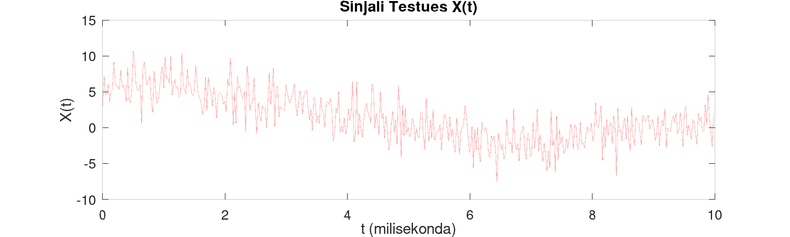
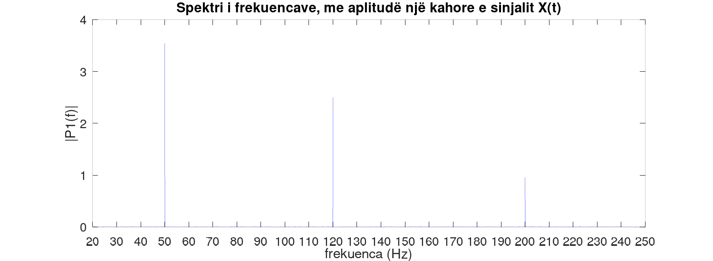
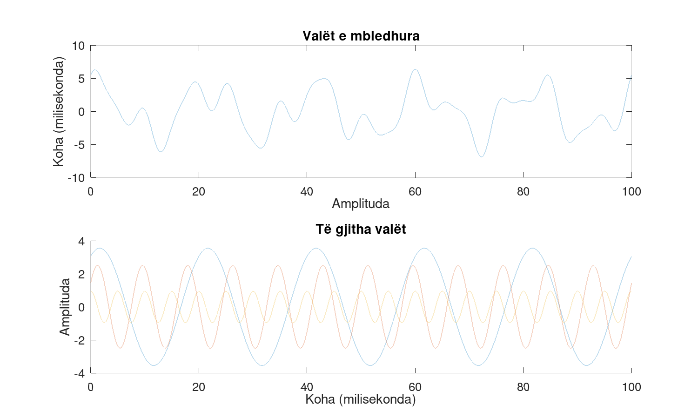

<p align="center">
<h1 align="center">Algoritmi i Transformimit të shpejtë të Fourier-it (Fast Fourier Transform Algorithm) në MATLAB/GNU Octave</h1>

## Transformimi i Fourier-it

Transformimi i Fourier-it është një metodë matematike e cila dekompozon një funksion të vazhdueshëm në spektrin e frekuencave prej të cilave përbëhet ajo. Kjo përdoret për të analizuar përmbajtjen e frekuencave të një funksioni, ndërsa në industrinë profesionale operacionet si filtrimi, kompresimi, si dhe procesimi i sinjaleve (audio, telekomunikimi, imazhet etj.) përdorin Transformimin e Fourier-it. Zbatim tjetër tejet të rëndësishëm gjen në Fizikë, me ndikim më të madh ka në Fizikën Teorike veçanërisht ne Fizikën Kuantike ku dekompozimi i valëve përveç se në hapirën Euklidiane, kërkohet edhe në hapsira vektoriale 3,4 apo $\mathbb{R}^n$ dimensionale.

Transformimi i Fourier-it është i definuar si një transformim i integralit i cili merr një funksion $f(t)$ i definuar në domen të kohës $t$, ku e pasqyron atë në një funksion $F(\xi)$ në domenin e frekuencës $\xi$. Në këtë rast funksioni $F(\xi)$ paraqet Transformimin e Fourier-it të funksionit $f(t)$. Për tu kthyer sërish në domenin e kohës $t$ përdoret Inversi i Tranformimit të Fourier-it mbi funksionin $F(\xi)$.

Transformimin e Fourier-it në formulë matematike e shënojmë si vijon:

> $$
> \large
> F(\xi) = \int_{-\infty}^{\infty} f(t)\ e^{-i2\pi \xi t} \,dt .
> $$

Rrjedhimisht Inversi i Transformimit të Fourier-it merr formën:

> $$
> \large
> f(t)=\int_{-\infty}^{\infty} F(\xi)\ e^{i2\pi\xi t} \, d\xi ,\quad \forall \ t\in \mathbb{R} .
> $$

### Transformimi Diskret i Fourier-it (Discrete Fourier Transform - DFT)

Transformimi Diskret i Fourier-it transformon një sekuencë (varg) me $n$ numra kompleks $\mathbb{(C)}$:
$\{\mathbf{x}_n\} \coloneqq x_0, x_1, \dots,x_{N-1}$ në një varg tjetër numrash kompleks:
$\{\mathbf{X}_n\} \coloneqq X_0, X_1, \dots,X_{N-1}$, e cila definohet nga formula:

> $$
> \large
> x_k=\sum_{n=0}^{n-1}x_n \cdot e^{-\frac{i2\pi}{N}kn} =\sum_{n=0}^{n-1}x_n \cdot \left[\cos(\frac{2\pi}{N}kn)\ - i\ \sin(\frac{2\pi}{N}kn)\right],
> $$

## Implementimi

### Konstruktimi i sinjalit

Konstruktimin e sinjalit e bëjmë duke mbledhur funksione të ndryshme valore të cilata kanë katër parametra themelor:

- Frekuenca
- Koha
- Amplituda
- Faza

Një valë e thjeshtë sinusoidale ndërtohet nga formula:

> $$ \large y(t)=A \cdot sin(2\pi ft + \phi)$$

Rrjedhimisht një funksion i cili do të na gjeneronte sinjale të rëndomta do të merrte formën:

> $$ \Large \sum\_{k=0}^{n} A_k \cdot sin(2\pi f_k \cdot t + \phi_k) \ + \psi_k(t)$$

ku:

- $t$ - paraqet kohën, e cila në funksionin tonë ushqehet si vektor (fushë vektoriale të rendit $\mathbb{R}^1$) me vlera diskrete.
- $A$ - paraqet amplitudën (fuqinë e sinjalit).
- $f$ - paraqet frekuencën (e cila matet me Herc-$Hz$ nëse koha ka njësi bazë sekondin-$s$).
- $\phi$ - paraqet fazën (zhvendosjen valore), $\quad \phi \in [0,2\pi].$
- $\psi$ - paraqet funksionin tonë personal i cili do ta fsheh sinjalin me zhurmë.

Në shembullin tim do të konstruktoj sinjalin testues duke mbledhur 3 funksione të ndryshme valë sinusoidale. Formalisht, kjo do të dukej në MATLAB si vijon:

Definimi i parametrave të vargut diskret (DFT):

```octave
Fs  = 44100;                    % Frekuenca
T   = 1/Fs;                     % Perioda
dur = 10;                       % Kohëzgjatja
L   = Fs*dur;                   % Gjatësia e sinjalit
t   = (0:L-1)*T;                % Hapsira vektoriale kohore
```

Definimi i parametrave të valëve simuluese:

```octave
f1 = 50;                        % Frekuenca e valës së parë
f2 = 120;                       % Frekuenca e valës së dytë
f3 = 200;                       % Frekuenca e valës së tretë
A1 = 3.55;                      % Amplituda e valës së parë
A2 = 2.50;                      % Amplituda e valës së dytë
A3 = 0.95;                      % Amplituda e valës së tretë
p1 = pi/3;                      % Faza e valës së parë
p2 = pi/5;                      % Faza e valës së dytë
p3 = pi/2;                      % Faza e valës së tretë

wav1 = A1*sin(2*pi*f1*t + p1);  % Vala e parë
wav2 = A2*sin(2*pi*f2*t + p2);  % Vala e dytë
wav3 = A3*sin(2*pi*f3*t + p3);  % Vala e tretë

S = wav1 + wav2 + wav3;         % Sinjali i fituar pas shumës së valëve
X = S + 2*randn(size(t));       % Sinjali i fshehur me zhurmë
```

Shfaqja e sinjalit testues në graf:

```octave
figure(1,'position',[0,0,1500,450]);
factor = 1000;
zoom = L/factor;
plot(1000*t(1:zoom),X(1:zoom), 'LineWidth', 1.25, 'Color', 'r')
title("Sinjali Testues X(t)")
xlabel("t (milisekonda)")
ylabel("X(t)")
```



Regjistrimi zëror i sinjalit testues si file:

```octave
audiowrite('noise.wav', X, Fs);
```

Aplikimi i Transformimit të Shpejtë të Fourier-it:

```octave
Y = fft(X);                     % Invokimi i funksionit i cili bën Transformimin e Shpejtë të Fourier-it
P2 = abs(Y/L);                  % Kalkulimi i Amplitudës
P1 = P2(1:L/2+1);               % Përgjysmimi i Amplitudës si pasojë e simetrisë
P1(2:end-1) = 2*P1(2:end-1);    % Rikthimi i energjisë
```

Paraqitja grafike e spektrit frekuencor:

```octave
f = Fs*(0:(L/2))/L;
xvec = [20 250];
xax  = xvec(1):10:xvec(2);
figure(1,'position',[0,0,1500,550]);
plot(f,P1, 'Color', 'b')
xlim(xvec)
xticks(xax)
title("Spektri i frekuencave, me aplitudë një kahore e sinjalit X(t)")
xlabel("frekuenca (Hz)")
ylabel("|P1(f)|")
```



Paraqitja grafike e Sinjalit të pastër dhe përbërjes së saj:

```octave
factor = 100;
zoom = L/factor;
figure(2, 'position', [0,0,1500,900]);
subplot(2,1,1);
plot(1000*t(1:zoom),S(1:zoom), 'LineWidth', 2)
xlabel('Amplituda')
ylabel('Koha (milisekonda)')
title('Valët e mbledhura')

subplot(2,1,2);
hold all;
plot(1000*t(1:zoom),wav1(1:zoom), 'LineWidth', 2)
plot(1000*t(1:zoom),wav2(1:zoom), 'LineWidth', 2)
plot(1000*t(1:zoom),wav3(1:zoom), 'LineWidth', 2)
xlabel('Koha (milisekonda)');
ylabel('Amplituda');
title('Të gjitha valët');
hold off;
```



Regjistrimi zëror i sinjalit si file pasi kemi aplikuar Transformimin e Fourier-it:

```octave
audiowrite('signal.wav', S, Fs);
```

$$
$$
