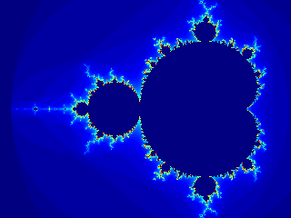

<p align="center">
<h1 align="center">Implementimi i Mandelbrot Set në MATLAB/GNU Octave</h1>

## Mandelbrot Set

Mandelbrot Set (Bashkësia e Mandelbrot) është një bashkësi e numrave kompleks, e cila është e definuar në këtë mënyrë:
Një numër kompleks i takon Mandelbrot Set nëse ekuacioni rekruent
$$Z_{n+1} = {Z_n}^2 + c$$
iterohet me kushtet

- $Z_0 = 0$,
- $\mid Z_n \mid < k,\quad \forall n \quad$ dhe zakonisht $k=2$

Në këtë rast ekuacioni $Z_{n+1} = {Z_n}^2 + c$ quhet ekuacioni Mandelbrot.
Ky ekuacion përshkruan se si një numër kompleks, i përfaqësuar nga ndryshorja $Z$, ndryshon me kalimin e kohës, ose mbi numrin e përsëritjeve, n. Numri kompleks $c$ është një konstantë, dhe kjo përcakton sjelljen e ekuacionit.

Mandelbrot Set zakonisht paraqitet grafikisht, me pjesën reale në boshtin $x$ dhe pjesën imagjinare në boshtin $y$. Pikat në grafik që i përkasin grupit Mandelbrot janë me ngjyrë të zezë, ndërsa pikat që nuk i përkasin grupit ngjyrosen sipas asaj se sa shpejt vlera absolute e Z kalon 2. Imazhi që rezulton është një fraktal, i cili është një formë gjeometrike që shfaq vetëngjashmëri në shkallë të ndryshme.

Kompleti Mandelbrot ka shumë veti interesante dhe ka frymëzuar shumë kërkime matematikore. Është veçanërisht temë e njohur dhe e dëshiruar studimi në shkencat kompjuterike, pasi që mund të llogaritet dhe vizualizohet lehtësisht duke përdorur ndonjë gjuhë programuese.

### Aplikimi në jetë

Kompleti Mandelbrot nuk ka aplikime të drejtpërdrejta praktike, por ka frymëzuar zhvillimin e disa teknikave dhe algoritmeve që kanë aplikime praktike.
Për shembull, koncepti i kohës së ikjes (escape time), i cili përdoret për të përcaktuar nëse një pikë i përket grupit Mandelbrot, aplikohet për kompresim të imazheve.

Në kompresimin e imazhit, një imazh ndahet në blloqe dhe ekuacioni Mandelbrot përdoret për të koduar vlerat e pixel në secilin bllok.
Konstanta $c$ zgjidhet e tillë që sjellja e ekuacionit të pasqyrojë vlerat e pixel në bllok.
Numri i përsëritjeve të nevojshme që vlera absolute e $Z$ të tejkalojë një prag të caktuar përdoret si masë e kompleksitetit të bllokut dhe blloqet me më pak përsëritje mund të kodohen duke përdorur më pak bit.
Kjo mundëson kompresim më efikas të imazhit.

Mandelbrot Set ka frymëzuar gjithashtu zhvillimin e teknikave të tjera të bazuara në fraktal,
të tilla si interpolimi fraktal dhe gjenerimi i imazheve fraktal,
të cilat kanë aplikime në fusha të tilla si grafika kompjuterike dhe vizualizimi i të dhënave.

Përveç aplikimeve praktike, Mandelbrot Set ka qenë gjithashtu objekt i shumë kërkimeve matematikore dhe ka frymëzuar zhvillimin e teknikave dhe koncepteve të reja matematikore.
Vizualizimi i saj konsiderohet si një objekt i bukur dhe magjepsës në vetvete dhe studimi i tij ka kontribuar në të kuptuarit tonë të dinamikës komplekse dhe sjelljes së funksioneve të përsëritura.

## Implementimi

Implementimi i vizualizimit në Octave, merr formën si vijon:

```octave
max_iter  = 100;          % Numrin maksimal të iterimeve
threshold = 2;            % Vendosim pragun k=2

img = zeros(1600, 1600);  % Krijojmë një imazh të thatë me dimenzione 1600x1600 pixels

figure(1,'position', [400,100,1000,800]) % Krijojmë dritaren për të shfaqur imazhin

% Duke shfrytëzuar natyrën simetrike të Mandelbrot Set, për shkaqe të efikasitetit iterojmë vetëm gjysmën e pikselëve
for y = 1:800
  for x = 1:1600
    % Konvertojmë koordinatat e pixel në numra kompleks
    z = (x - 800) / 400 + (y - 800) / 400 * 1i;

    % Iterojmë funksionin f(z) = z^2 + c
    c = z;
    for n = 1:max_iter
      if abs(z) > threshold
        break
      end
      z = z^2 + c;
    end

    img(y, x) = n;             % Ruajmë numrin e iterimeve në imazh

    img(1600 - y + 1, x) = n;  % Shfrytëzojmë simetrinë e Mandelbrot Set për të mbushur gjysmën e poshtme të imazhit
  end

  % Përditësojmë paraqitjen grafike çdo 20 iterime për të parë ndryshimet në kohë reale
  if mod(y, 20) == 0
    imagesc(img);
    colormap(jet);
    drawnow;
  end
end
```

Shfaqja e imazhit:

```octave
imagesc(img);
colormap(jet);
```

<p align="center">

Rezultati i animuar:

<p align="center">
